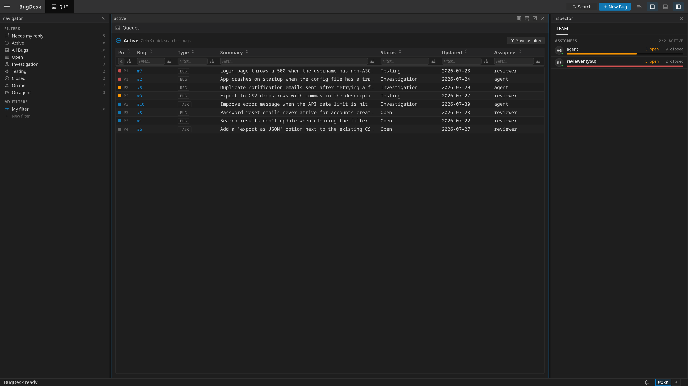

# BugDesk

A local, markdown-backed bug tracker **and backlog** built to end the
coordination/authorship problem of shared GitHub Issues: bugs and feature work
are plain markdown files that an AI coding agent edits directly and a human
triages through a tiling UI — no API round-trip, no `gh`-token authorship
ambiguity, git-tracked alongside the code they describe.

It also runs as a **[tracker](#tracker-mode)** (`./run.sh --tracker`) — a
follow-up list for work you have handed to other people, with target dates and
a dashboard of what is late.



```
bugdesk/
  server/    C# bridge (.NET 10 minimal API): serves ui/ + JSON API over both stores
  ui/        Tiling shell + bug/backlog UI, depending on the FlexDesk package
  skills/    /bugs, /backlog and /tracker — Claude Code skills that teach an agent the formats
  scripts/   sync-flexdesk.mjs — refresh ui/vendor/flexdesk/ from the npm package
  examples/  sample bugs and backlog items for --seed
  run.sh     dotnet run wrapper (Linux/macOS/WSL)
  run.ps1    dotnet run wrapper (Windows PowerShell)
```

## Two stores

| | bugs | backlog |
|---|---|---|
| what it holds | what broke | what you meant to build |
| files | `BUG-NNNN.md` | `PROJ-`/`EPIC-`/`STORY-`/`TASK-NNNN.md` |
| default location | `./bugs` | `./backlog`, beside the bug store |
| override | `BUGDESK_BUGS` | `BUGDESK_BACKLOG` |
| lifecycle | open → investigation ⇄ testing → closed | per type — see below |
| distinguishing fields | severity, subsystem | parent, phase, points, acceptance criteria, target date |
| type | `bug`, `regression`, `chore` | `project`, `epic`, `story`, `task` |
| skill | [`/bugs`](skills/bugs/SKILL.md) | [`/backlog`](skills/backlog/SKILL.md), [`/tracker`](skills/tracker/SKILL.md) |

Both are directories of markdown files — a YAML-frontmatter block plus
`## Description`, `## History` and `## Comments` sections (the backlog adds
`## Acceptance criteria`). That is the source of truth; the server only reads
and writes those files. Point `BUGDESK_BUGS` at a `bugs/` directory tracked
inside your own project's repo and the backlog follows automatically as its
sibling, so both histories live alongside the code.

Keeping them apart is deliberate: a bug has a severity and a reproduction, an
item has a size and an acceptance criterion, and one record type carrying both
makes every field optional for half the rows.

### The backlog hierarchy

```
EPIC-0001  Auth rewrite            phase: foundation
 ├ STORY-0007  Log in with SSO     parent: 1
 │  ├ TASK-0031  wire OIDC client  parent: 7
 │  └ TASK-0032  session cookie    parent: 7
 └ STORY-0008  Revoke propagation  parent: 1
```

IDs are **one sequence shared by all four prefixes**, which is what makes
`parent: 7` unambiguous without also naming a type — and what lets a bug point
at backlog work with `links: [relates-to STORY-7]`.

`PROJ` is the fourth level, above epics. It is offered in the Type select only
in [tracker mode](#tracker-mode), but it is a legal record everywhere: a store
written by a tracker opens correctly in a plain backlog, and vice versa.

A **phase** is a milestone label carried on an *epic* (`phase: foundation`);
stories and tasks inherit it from their nearest ancestor. So a work package
moves between phases by editing one line in one file, and "what's left in the
foundation phase" is answerable without stamping the same string onto every
descendant.

`refined` is the one status with a definition rather than a convention — an
item is refined when it has acceptance criteria, an estimate and a parent. The
UI lists exactly which of those checks a `draft` still fails, and
[`skills/backlog/REFINEMENT.md`](skills/backlog/REFINEMENT.md) applies the same
five rules. They are defined once, in
`ui/js/ticketdesk/backlog_data.js`'s `REFINEMENT_RULES`.

**Descriptions are editable in place** — read as rendered markdown, edited in
the same composer the create mask uses, with the same paste-a-screenshot
support. An open editor counts as unsaved work, so an incoming change from
somewhere else asks before replacing it rather than discarding a paragraph
mid-sentence.

**Pasted URLs are linked and shortened.** A record accumulates links — a PR, a
build, a vendor's ticket — and one of them can be wider than the tile it sits
in. A bare URL becomes a link whose text drops the scheme and elides the middle
of a long path (`build.example.com/jobs/…/report.html`), with the full URL in
the title. A link you gave a label to keeps its label. Titles are **not**
fetched: that would mean the browser reaching out to every host mentioned in
every record, and a quiet promise that reading a bug report tells somebody's
server you read it.

**Acceptance criteria are a checklist you tick**, not markdown you hand-edit —
add, rename, remove and tick rows in place, with the markdown editor one click
away for bulk edits. Each change is one addressed operation on one line rather
than a rewrite of the section, so a sentence of context or a nested sub-bullet
that the checklist never parsed survives the first time anyone ticks a box.

## Run

```bash
./run.sh --help                       # every option and environment variable
./run.sh                              # http://127.0.0.1:8766, ./bugs + ./backlog
./run.sh --seed                       # + pre-seed empty stores with the examples
./run.sh --tracker                    # TRACKER mode — its own store, auto port
./run.sh --tracker --project acme     # ...naming the tracker explicitly
./run.sh --tracker --seed             # + an example project with dated work on it
./run.sh --bugs-dir /path/to/bugs     # backlog follows as its sibling
./run.sh --bugs-dir /a/bugs --backlog-dir /b/backlog   # or place them separately
BUGDESK_BUGS=/path/to/bugs ./run.sh   # the same, as an environment variable
BUGDESK_USER=alice ./run.sh           # pick a profile without the first-run prompt
BUGDESK_HUMAN=alice BUGDESK_AGENT=claude ./run.sh   # seed a profile, skip the prompt
```

On Windows, `run.ps1` is the same wrapper for PowerShell (5.1 or 7):

```powershell
.\run.ps1 --help              # every option and environment variable
.\run.ps1                     # http://127.0.0.1:8766, .\bugs + .\backlog
.\run.ps1 --seed              # + pre-seed empty stores with the examples
.\run.ps1 --tracker           # TRACKER mode
.\run.ps1 --bugs-dir C:\path\to\bugs     # backlog follows as its sibling
$env:BUGDESK_BUGS='C:\path\to\bugs'; .\run.ps1
$env:BUGDESK_HUMAN='alice'; $env:BUGDESK_AGENT='claude'; .\run.ps1
```

Both stores can be set by flag (`--bugs-dir`, `--backlog-dir`, in either the
space or the `=` spelling) or by variable (`BUGDESK_BUGS`, `BUGDESK_BACKLOG`).
**The flag wins**, because it is typed for this one run while a variable may
have been exported hours ago — and setting the bug store alone moves the backlog
with it, since the backlog default is its sibling. The server understands the
same two flags, so `dotnet run --project server -- --bugs-dir …` behaves
identically to the wrappers.

Neither script changes your working directory. They hand the server's path to
`dotnet run --project` rather than `cd`-ing into `server/` first, so the shell
you started from is the shell you come back to when you stop the server. That
matters most in PowerShell, where a location change made inside a script
outlives it — `.\run.ps1` used to leave you sitting in `server\`. It also keeps
`--tracker` honest, since the directory you ran from is what names the tracker.

`--seed` copies the samples from `examples/` into the stores the first time. It
seeds each store **independently** and never touches one that already has
records, so it's safe to leave in your usual command — and a repo that already
tracks bugs but has no backlog yet still gets seeded backlog examples.

Requires the .NET SDK (`dotnet`, tested on 10.0.100). No build step for the
UI — it is ES modules served straight off disk through an import map.

## Who you are

**The first time you open BugDesk it asks for your name.** Everything in the
two stores is shared and committed, which is the point; everything about the
person reading them is not. Your name, your saved filters and your window
layout go into a git-ignored file beside the stores, so several people can work
the same repo without overwriting each other on every pull:

```
your-project/
  bugs/BUG-0001.md          tracked
  backlog/EPIC-0001.md      tracked
  .bugdesk/
    .gitignore              ignores everything in here EXCEPT project.json, so
                            the rule itself says which half is shared — and your
                            project's own .gitignore never needs an entry
    project.json            TRACKED — the collaborator roster (see below)
    active.json             which profile this checkout is using
    user-alice.json         alice's name, filters and settings
    user-bob.json           bob's
    state-alice/            alice's tile layout and desktops
```

**One directory, two halves, and the `.gitignore` is what tells them apart.**
`project.json` is the team's and is committed; everything else is yours and is
not. The split matters — two people sharing a repo must agree on who exists and
must *not* overwrite each other's identity — but it used to be expressed as a
`bugdesk.json` at the project root next to a `.bugdesk/` directory, which reads
as two names for one thing. It is now stated at the point where it actually has
an effect.

Override the location with `BUGDESK_CONFIG`. Two people sharing one checkout
can each start their own server with `BUGDESK_USER=<name>`, which selects a
profile for that process without repointing `active.json`.

**This file beats the environment.** `BUGDESK_HUMAN`/`BUGDESK_AGENT` seed it
when there is none — see [Authorship](#authorship) — and stop mattering once
there is.

Who you are is shown in the **bottom-left corner** at all times — in a repo
several people share, that is the one piece of state you want to be able to
check before commenting as somebody else. Clicking it opens
**Settings › General › Authorship**, where the name is editable; changing it
switches BugDesk to that person's profile (creating it if the name is new),
along with their saved filters, and writes through to the profile on disk so
`/api/config` and the UI can never disagree about who you are.

## Live updates

The markdown files are the source of truth precisely so **other things write
them** — a `git pull`, an agent working through the `/bugs` skill, somebody's
editor. The bridge watches both store directories and pushes changes to every
open browser over Server-Sent Events (`GET /api/events`), so the UI is never
looking at a store that has moved on without it.

| what changed | what happens |
|---|---|
| a record, anywhere | the queue and the backlog tree repaint |
| the record you have open, **no unsaved edits** | it refreshes silently |
| the record you have open, **unsaved edits** | you are asked: *discard mine and reload*, or *keep my edits* (the next save overwrites) |
| the record you have open, **deleted on disk** | you are told; saving writes the file again |

Discarding your edits to show you somebody else's is not a decision to make on
your behalf, and neither is silently overwriting theirs — so when there is
something to lose, the page says so and both choices are one click.

**Your own saves never announce themselves.** Every write BugDesk makes also
trips the watcher, so the bridge records the SHA-256 of what it wrote and treats
a file that still hashes to that value as its own echo. A timing window would
have been the obvious fix and the wrong one: a slow disk turns it into a race.

A burst is coalesced over a 250 ms quiet period — a `git pull` rewriting twenty
files should be one repaint, not twenty — and the stream sends a comment
heartbeat every 25 s so proxies do not drop it as idle.

## Collaborators

`.bugdesk/project.json` is who can be assigned work here. It is the one file in
that directory that is **committed**:

```json
{
  "collaborators": [
    { "name": "norman", "agent": "norman_agent", "added": "2026-09-10" },
    { "name": "alice",  "agent": "alice_agent",  "added": "2026-09-12" }
  ]
}
```

It is the deliberate opposite of the per-user profiles beside it: those are
private because two people must not overwrite each other's identity; this one is
shared because they have to agree on who exists. Every assignee picker and both
filter catalogues read it.

**Upgrading.** This used to be `bugdesk.json` at the project root. That path
still wins when a file is there, so nothing breaks and nothing moves under you.
To adopt the new layout:

```bash
git mv bugdesk.json .bugdesk/project.json
```

BugDesk also appends the `!project.json` rule to an existing `.bugdesk/.gitignore`
on startup, so the moved file is committable — without that it would be written,
look fine locally, and silently never reach anyone else's checkout.

The list maintains itself: setting your name adds you, **assigning to a name
that is not on it adds that person**, and the `/bugs` and `/backlog` skills add
the people they find in the git history. Edit it directly — add, rename, change
an agent name, remove — from **Settings › General › Authorship › Manage
collaborators**, the hamburger menu's **Collaborators…**, or the change-your-name
dialog. Override the path with `BUGDESK_PROJECT`. `GET /api/project` reports the
resolved `path`, which is the quickest way to see which file the running UI has
in force; an agent works it out from the same three rules, in the same order.

Each person's agent name is **derived** as `<name>_agent`. It is not a decision
worth making per project, and two people whose assistants both sign as `agent`
cannot be told apart in a comment thread.

**Not in tracker mode.** A tracker records work handed to *people* — colleagues,
vendors, counterparts — and none of them has an assistant in that store, so no
`<name>_agent` is created or offered. An agent entry beside every person would
be a row in every picker that can never legitimately be chosen. The `/tracker`
skill still signs its comments as an agent; it is just not somebody you assign
work to.

## Authorship

BugDesk assumes exactly two roles — a human who files/triages/tests through
this UI, and an agent who investigates and builds — but neither name is fixed.
Resolution order, highest first:

| source | notes |
|---|---|
| the per-user profile | `.bugdesk/user-<name>.json` — what the first-run screen and "change your name" write. **The normal case, and the authority.** |
| `BUGDESK_HUMAN` / `BUGDESK_AGENT` | environment. A **seed**, not an override: used when there is no profile yet, and a profile is written from it on the spot — which is what **suppresses the first-run prompt** for a scripted deployment. |
| `reviewer` / `agent` | generic fallback |

**The profile wins, and that is the whole point of it.** The order used to run
the other way, with no way out: with `BUGDESK_HUMAN` exported in a shell
profile, "change your name" wrote a file the server then ignored on every boot,
for ever. An environment variable is how a process is *started*; a config file
is what the user *changed*, and the more recent, more deliberate statement is
the one that counts.

Seeding deliberately does **not** write `active.json`, exactly as `BUGDESK_USER`
does not: one `BUGDESK_HUMAN=bob ./run.sh` must not silently repoint the
checkout's default for everyone else. Changing the name in the UI is an explicit
act, and that does persist.

The one thing an environment variable could do that a file cannot — give two
people sharing one checkout a different identity per process — is what
**`BUGDESK_USER`** is for, and it still works: it selects a profile for that
process only.

The server exposes the resolved pair via `GET /api/config`; the UI fetches it
before anything else renders, so every default assignee, comment placeholder
and filter ("On me", "On \<agent\>", "Needs my reply") reflects it. Every
comment is a `### YYYY-MM-DD · <author>` block — that is the whole point of the
format: you always know who said what, without depending on GitHub's issue
authorship or a `gh` token.

**`assignee` says whose court a record is in; `reporter` says whose *list* it is
on.** One field can only answer one of those questions, and `assignee` moves
every time the work does — so by the time a bug is back in `testing`, nothing in
the file remembers who asked for it. An agent hands work back to the record's
**`reporter`**, never to "the human": on a store several people share, "the
human" resolves to whoever the *agent's own* profile names, and a record handed
to the wrong person is worse than one handed to nobody, because it stops looking
like a gap.

`reporter` is written once, when the record is filed, and defaults to the
configured human; the detail page offers it beside Assignee for the case where
you are filing on somebody else's behalf. An **absent** `reporter:` reads as the
configured human and the file is left alone — nothing backfills it, in either
store. A backfilled reporter is a guess written as a fact, and the read-time
fallback costs nothing.

Because the name comes from a profile rather than the environment, **an agent
must not assume `BUGDESK_HUMAN` tells it anything** — it may be unset, or set to
somebody the user has since changed away from. The skills read the profile off
disk instead, in the server's own order: `BUGDESK_USER` or `.bugdesk/active.json`
for the slug, then `.bugdesk/user-<slug>.json` for the pair, then the
environment, then the defaults.

**The skills never call this server**, and none of them needs it running. Every
answer it could give is in the files they already have — and a server listening
on this machine may be serving a *different* project, so asking it is not a
harmless shortcut: it is how an agent ends up signing as somebody else.

## API

Same-origin JSON, backed by the markdown files:

| method | path | purpose |
|---|---|---|
| GET  | `/api/bugs` | list (summaries, sorted by priority) |
| GET  | `/api/bugs/{id}` | one bug: frontmatter + description + parsed comments + history |
| POST | `/api/bugs` | create; the id is assigned server-side |
| POST | `/api/bugs/{id}` | update frontmatter (status/severity/assignee/reporter/subsystem/labels/…) |
| POST | `/api/bugs/{id}/comments` | append a `### date · author` comment |
| POST | `/api/bugs/{id}/duplicate-of` | close this bug as a duplicate of another record — link, status, history and both comments in one request |
| GET  | `/api/meta` | aggregate counts by status/subsystem/assignee/severity |
| GET  | `/api/backlog` | list, already in **tree order** (epic, its stories, their tasks) |
| GET  | `/api/backlog/{id}` | one item + ancestors + children + criteria + comments + history |
| POST | `/api/backlog` | create; id assigned server-side, parent validated |
| POST | `/api/backlog/{id}` | update frontmatter, `## Description` or `## Acceptance criteria` |
| POST | `/api/backlog/{id}/comments` | append a comment |
| POST | `/api/backlog/{id}/criteria` | tick / add / edit / remove one acceptance criterion |
| POST | `/api/backlog/{id}/duplicate-of` | the same act for an item — it **drops** rather than closes |
| GET  | `/api/backlog/meta` | counts by status/type/assignee, the phase vocabulary, the file prefixes, how many items carry a target date, and the per-type lifecycle ladders |
| GET  | `/api/config` | the **mode** (`bugs`/`tracker`), resolved names, whether a profile exists, the profiles there are |
| POST | `/api/config/user` | adopt a profile by name (what the first-run screen posts) |
| GET/POST | `/api/user/settings` | the UI's own preference bag, stored in the profile |
| GET/POST | `/api/filters` | the user's saved queue filters — **per profile** |
| GET  | `/api/project` | the shared config: the collaborator roster and the flat assignee list |
| POST | `/api/project/collaborators` | replace the roster (what the Settings editor saves) |
| POST | `/api/project/collaborator` | add or update one person, without sending the whole roster |
| POST | `/api/attachments` | upload one image (base64), returns its `/attachments/…` URL |
| GET  | `/api/search` | fulltext across both stores — titles, descriptions, criteria and comments — ranked, with a snippet |
| DELETE | `/api/backlog/{id}` | delete a record to `trash/`; `?children=cascade\|promote` decides what happens to what was under it |
| GET  | `/api/events` | Server-Sent Events: records changed on disk by anything but BugDesk |

**`reporter` and `history` ride on the record**, not on endpoints of their own.
A summary from `GET /api/bugs` carries `reporter` and a `history` **count**; the
full record from `GET /api/bugs/{id}` carries `reporter` and a `history` array
of `{date, actor, field, from, to, note}` — exactly the shape `comments` already
has, so a record and its trail arrive together and cannot disagree about what
happened. `field` is `status`, `assignee`, `reporter`, or `""` for a line that
is free text; `from` and `to` are `""` for an unset value, because the `(unset)`
spelling exists to keep a diff readable and has no business in JSON. Backlog
items carry `history` the same way, and have carried `reporter` since tracker
mode. A write may name an `actor`, which is who the history line is attributed
to; it is never stored as a field.

**The `duplicate-of` routes** take
`{"target": "STORY-7" | 52 | "#52", "actor": "", "comment": ""}`. `target` is
required and accepts anything a `links:` token accepts, prefix matching is
case-insensitive, `actor` defaults to the configured human, and `comment`
replaces the generated sentence on the record being closed — never the one left
on the master, which has to say what arrived. A success answers with the whole
updated record plus `target:{store, id, ref, title}`, so the page repaints every
pane with no follow-up GET. `WIDGET-1` is a 400 (not a reference at all);
`STORY-9` parses and comes back 404 if there is no item 9.

**BugDesk never runs git.** There is no `/api/git`, nothing in the server shells
out, and no history anywhere is derived from `git log` — the `## History`
section is the record's own. A record you edit in the UI is therefore sitting
uncommitted in the working tree, for you or for an agent to commit.

Every other `/api/<method>` returns `{ok:true,result:{ok:true}}` so the shell
boots and renders its empty states.

Tree order is computed **server-side** on purpose: an item's depth is a
function of the whole store, so doing it in the client means every consumer
re-derives it and gets to disagree about orphans and cycles.

## Bug lifecycle

Four states. `assignee` is **explicit** — set by whoever last touched the bug
(the UI's reassign control, or the agent moving it along) — never derived from
`status`, so there's always a clear "whose court is this in."

```
open ──▶ investigation ⇄ testing ──▶ closed
        (closed may reopen to investigation on regression)
```

| status | stage | typical owner | meaning |
|---|---|---|---|
| `open` | 0 | human | first entry — **one-way out**, nothing returns here |
| `investigation` | 1 | agent | on the agent to investigate and fix |
| `testing` | 2 | human | on the human to verify the fix |
| `closed` | 3 | human | verified and done |

The queue's left rail filters on the fields the summary API exposes — notably
**"Needs my reply"** = bugs whose last comment was the agent's
(`lastCommentAuthor == <agentAuthor>`), so the human hasn't responded yet.

**Every move is recorded in the file.** A `## History` section, above
`## Comments`, carries one append-only line per transition —
`- 2026-09-12 · norman_agent · status: investigation -> testing` — and the
detail page shows it in a **History** tab beside Comments. Both stores have one.

Three fields are tracked and no others: `status`, `assignee` and `reporter`. A
retitle or a severity bump is a diff, and an audit trail that records everything
is one nobody reads; these three are the ones somebody *decided*. There is no
stored "filed" line either — the row at the bottom of the tab is derived from
`created` and `reporter`, so writing one by hand only produces a duplicate. The
line grammar (the leading `- `, the two `·` separators, the ASCII `->`,
`(unset)` for an empty side) is spelled out in
[`skills/bugs/SKILL.md`](skills/bugs/SKILL.md), which is what an agent writing
the file directly reads; a line that does not fit it is shown as free text
rather than dropped.

## Relationships

A record's `links:` list holds `<verb> <target>` tokens, and a target may name a
record in **either** store:

```yaml
links: [duplicates 12, implements STORY-0007, blocked-by BUG-0052]
```

| verb | shown on the other record as |
|---|---|
| `duplicates` | is duplicated by |
| `blocks` | is blocked by |
| `blocked-by` | blocks |
| `requires` | is required by |
| `caused-by` | causes |
| `relates-to` | relates to |
| `implements` | is implemented by |

`related` is accepted on read as an older spelling of `relates-to` and is never
written back.

**A bare number means this file's own store.** `blocks 47` in a bug is bug #47;
the same token in a story is item 47. A crossing target carries the target's
prefix, zero-padded to four — `STORY-0007` — and an unpadded `STORY-7` parses
fine and is never rewritten where it sits. The prefix is display sugar plus a
store discriminator: backlog ids are one sequence shared by all four prefixes,
so `STORY-7` and `EPIC-7` are the same item. Identity is `{store, id}`, and
every write re-derives the prefix from the record it resolved rather than from
what was typed, because retyping a story to a task would otherwise leave
`STORY-` printed in every file that mentioned it.

**Only the direction you wrote is stored.** The inverse row on the other record
is computed when the page is drawn, so there is no second file to keep in step
and no way for the two halves of a relationship to disagree. Any page that shows
links loads the other store first, once, so an inbound cross-store row does not
depend on which store you happened to open earlier.

**Mark as duplicate and close** is on both detail pages. Pick the master in the
cross-store picker and one request does the whole act: add the `duplicates`
link, close this record (`closed` for a bug, `dropped` for an item), append the
status line to `## History`, comment here saying what it was folded into, and
comment on the master saying what arrived. The master gets a comment rather than
a reverse link, for the reason above — and that comment is the half people
skipped when they did this by hand, which is the half that tells its reader the
two reports were merged.

## Finished work gets out of the way

A store accumulates closed records for ever. After a year they are most of it,
and a surface that lists them alongside live work buries the handful of things
you were actually looking for. So closed work — `done` and `dropped`, and a
`closed` bug — is **hidden by default on the surfaces you go to in order to act
on something**, and reachable on the ones you go to in order to look something
up:

| surface | closed work |
|---|---|
| the **search dialog** (parent, add-a-child, tracker Search) | hidden, with a **Closed** chip that brings it back. The count says how many were held back, so the chip is discoverable exactly when it would help |
| the **search page** | not searched, with an **Include closed** checkbox. Asking for `closed` in the Status field still wins — somebody who typed it means it |
| the left rail's **Projects** / **Work packages** tree | finished ones are not listed, and the badges count open items only |
| the rail's **Done** / **Closed** view | unchanged. It is the one place whose whole job is to answer "what did we finish" |
| **Everything** | unchanged |

The item a field currently points at is never hidden, whatever its status —
a picker that cannot show you what the field holds is a picker that makes the
field look empty.

## Who has what

The right-hand Inspector lists everyone with work in the store you are looking
at, weighted by what is still in flight. **Clicking a name opens that person's
open work in the main tile** — the same set the row's own count is of, so the
number and the list it opens can never disagree about what it meant. It follows
the top nav like the left rail does, so it opens tickets from the ticket list
and bugs from the bug queue, never the store you are not looking at.

## Filters

Both stores share one filter engine (`ui/js/ticketdesk/filter_engine.js`): a
JSON expression tree of AND/OR groups over clauses, with a visual editor, a live
preview and saved filters. What differs is the **field catalogue** each is bound
to — there is no severity in a backlog, and there is no hierarchy in a bug
queue:

| | fields |
|---|---|
| bugs | id, priority, severity, status, type, summary, subsystem, assignee, labels, created, updated, comments, last comment by/on |
| backlog | reference, type, status, title, **phase**, **epic**, **project**, **parent**, **depth**, assignee, **reporter**, **target date**, **due** (the derived standing), estimate, subsystem, labels, children, criteria met/total, created, updated, comments, last comment by |

Two of the backlog's fields exist only because of the hierarchy, and they are
what make the tree navigable by *query* rather than only by scrolling:
`epic` is the owning epic of any item however deep, so `Epic is EPIC-0001`
selects a whole work package; `project` is the same one level up; `depth`
expresses "only top-level things" without naming types.

The **builtin views differ by mode** — a manager chasing work does not groom a
backlog, so the tracker's rail leads with Overdue and drops "Needs refinement"
— but the **field catalogue does not**, so a filter saved in one mode keeps
resolving in the other.

Saved filters carry a **scope**, so the two rails never list each other's. They
live in your per-user profile, because two people on one repo have different
questions to ask of the same records.

## The left rail

One panel serving both stores, and **which rail you get follows the top nav** —
there is no switch in the rail itself. A panel kind can only be registered once,
so the alternative was picking a winner; tabs would have been a second,
competing answer to a question the top bar has already answered, free to
contradict it (BACKLOG lit above, bug filters below). The chip and the rail read
the same `activeTopNavKind(wm)`, so they cannot disagree.

The Backlog side carries **Views** (the builtins), **My filters**, and **Work
packages** — phases and their epics as a navigable tree. In tracker mode that
last section is **Projects** instead, each with its overdue count: one section
either way, because the store's shape is what you navigate there and the shape
differs by mode. The Tracker dashboard gets the same rail — it is a view over
the same store, so its saved filters belong one click away. Clicking an epic scopes
the board to that whole subtree, which is the same ad-hoc `epic is …`
expression the tree's own "Show only this work package" produces.

The rail navigates; it does not create.

## Filing something

There is one dialog, and one Type select spanning both stores:

```
New item ▸ Type:  Bug · Regression · Chore         →  bugs/BUG-NNNN.md
                  [Project ·] Epic · Story · Task  →  backlog/{PROJ,EPIC,STORY,TASK}-NNNN.md
```

**The form follows the Type.** A bug is asked for a severity, a story for a
parent and an estimate, a project for the phase its descendants inherit — and
in tracker mode every backlog type is also asked for a target date. Whether a
Parent row appears at all is derived from the hierarchy rules rather than listed
per type, which is why an epic is offered one in tracker mode (there are
projects to hold it) and not outside it (there are none).

**New Item** in the top bar opens it with nothing preselected — you say what the
thing is, and that decides which store it lands in. Two per-store buttons asked
you to choose a store before saying what you were filing, which is backwards:
the store is a property of the thing.

Each page also files its own kind, next to **Save as filter**, so the button
sits beside the list the new record will appear in:

| page | buttons |
|---|---|
| Bugs | **Bug** — opens the full mask, with a markdown editor and link staging |
| Backlog | **[Project ·] Epic · Story · Task** — the page, preselected and titled for the type |

## Search

**Ctrl+K is global fulltext search**, across both stores and over what is
actually *in* the files — the title and the reference, yes, but also the
description, the acceptance criteria and every comment. That last one is the
point: the thing you remember about a bug three weeks later is usually a phrase
somebody wrote in a thread, not its summary line.

Each result says **where** it matched and shows a snippet of it, with your terms
marked. A list of titles cannot tell three bugs about "the importer" apart; the
one you want is the one whose comment mentions the timeout, and the row says so.

Terms are ANDed but need not share a field — one may be in the title and the
other in a comment, which is how people actually narrow a search. A reference
beats a title beats a body beats a comment, and ties break on most recently
updated.

The matching happens on the **bridge** (`GET /api/search?q=`), because the list
endpoints return summaries: a client-side search can only ever match the columns
it was given. Every record is read and scanned per query — a store is a few
hundred markdown files a human triages by hand, and when that stops being true
the endpoint is where an index goes.

## Opening things without losing your place

Every list opens records by replacing something — the row takes over the tile
you were in, or arrives as a tab in front of it. That is right for working
through a queue and wrong for the thing triage mostly *is*: two records side by
side, a bug and the story it blocks, somebody's overdue list and the one item
you are about to ask them about.

Two gestures for that, in the bug queue, the ticket list and the Tracker
dashboard alike — and every cell of a row is a drag handle, so you do not have
to aim for a particular column:

| gesture | what happens |
|---|---|
| **drag a row onto any tile** | that tile displays the record. Every tile that can take it is outlined while you drag; panels are not offered, because dropping a bug onto the filter rail means nothing |
| **Ctrl-click a row** (⌘ on a Mac) | opens it **without taking the list off screen** — a floating window by default, or a genuinely background tab that waits for you. Set which in **Settings › General › Records** |

Neither replaces the plain click, because neither is discoverable on its own.
**Shift-click is left alone**: it is the table's range-select and the one
selection gesture with nowhere else to go.

Dragging a row out of BugDesk entirely — into an editor, a chat window, a commit
message — pastes its reference (`BUG-0042`), which is the only thing an outside
program could usefully do with it.

## Hierarchy

The backlog is a tree and reads like one:

```
▼ EPIC-0001  Auth rewrite
  ├─▼ STORY-0007  Log in with SSO
  │   ├── TASK-0031  wire OIDC client
  │   └── TASK-0032  session cookie
  └─▶ STORY-0008  Revoke propagation   +2
```

- **Guide lines and a fold caret** on every row with children. What's folded is
  saved to your profile, so a big epic stays folded between sessions, and a
  folded row shows how much it is hiding.
- **A filtered tree keeps ancestors as context**, dimmed. A story that matches
  is meaningless floating at the root with nothing saying which epic it belongs
  to — and an *unparented* story reads as a problem precisely because every
  other row sits under something.
- **The tile breadcrumb is the ancestry**: opening a task shows
  `Backlog › EPIC-0001 › STORY-0007 › TASK-0031`, each crumb navigable.

## Backlog lifecycle

The status **vocabulary** is shared by all three types. The **ladder** each one
walks is not:

```
PROJECT draft ──────────────▶ in-progress ──────────────▶ done
EPIC    draft ──▶ refined ──▶ in-progress ──────────────▶ done
STORY   draft ──▶ refined ──▶ in-progress ──▶ review ──▶ done
TASK    draft ──────────────▶ in-progress ──────────────▶ done

(any state) ──▶ dropped        done ──▶ reopen to the previous state
```

| status | meaning |
|---|---|
| `draft` | captured, not yet worth starting |
| `refined` | criteria, estimate, a place in the tree — **anyone can pick it up** |
| `in-progress` | someone is on it (`assignee` says who) |
| `review` | built; criteria being checked by someone other than the builder |
| `done` | criteria met |
| `dropped` | decided against. Off every ladder; the file stays, with a comment saying why. |

**An epic is never `review`** — an epic is not reviewed as a unit, its stories
are, one at a time. **A task is never `refined`** — it goes straight from draft
to in progress. That is about the ladder, not the criteria: **a task does not
inherit its parent's acceptance criteria**, it has its own or none. **A project
is neither `refined` nor `review`** — it is a container, and what "done" means
for it is that the work inside it is done. Sharing the
vocabulary keeps one status enum in the filter editor and one set of pills in
the CSS; varying the ladder is what stops either surface offering a transition
that means nothing.

The bridge enforces it: a status the type's ladder does not contain is rejected
with the ladder in the error, and retyping an item onto a shorter ladder clamps
its status **downward** — a story in `review` demoted to a task becomes an
`in-progress` task, never a `done` one, because nobody decided it was done.

## Tracker mode

```bash
./run.sh --tracker          # or BUGDESK_MODE=tracker ./run.sh
```

A different job, over the same files. The bug queue and the backlog are things
you work **in**: you pick something up, change it, close it. A tracker is
something you work **from** — a record of work you have handed to other people,
most of whom never open this checkout and some of whom have no idea it exists.

**Nobody else updates it.** Everything in it arrived because you, or an agent on
your behalf, put it there after a meeting, an email or a message. That is the
fact the whole mode is designed around, and it is why the dashboard leads with
what the tracker *cannot* tell you as prominently as with what it can.

**It is not a mode of a repo — it is a different app over the same file format.**

| | changes |
|---|---|
| where it lives | **not in your repo.** `~/.bugdesk/<project>/` (`%APPDATA%\BugDesk\<project>\` on Windows), one folder per tracked project |
| port | **picked automatically** — the next free one from 8766 |
| top nav | **TRACKER, and only Tracker.** No Bugs, no Tickets: everything is reached from the dashboard |
| types | adds **`project`** above epics; drops the bug types, since there is no bug store |
| assignees | **people only** — no `<name>_agent` is created or offered |
| fields | **`due`** (target date) and **`reporter`** on every record |
| board | a **Due** column, sorted chronologically, painted as a pill |
| left rail | **Projects** instead of Work packages; views lead with Overdue |
| skill | [`/tracker`](skills/tracker/SKILL.md) |

### Where the files are

```
~/.bugdesk/                       %APPDATA%\BugDesk\ on Windows
  acme-migration/                 one folder per tracked project
    tickets/                      PROJ-/EPIC-/STORY-/TASK-NNNN.md
    attachments/
    config/                       who you are, the roster, your window layout
  client-beta/
    ...
```

**Not in a repo, and that is the point.** A tracker is a record of work handed
to other people: it is not about the code in any checkout, most of the people in
it have never seen that checkout, and committing it would put private notes
about colleagues into a shared history. `bugs/` and `backlog/` inside a project
are the wrong home for it in every respect — including the names.

The project is named by the **directory you start the tracker from**, so
`cd ~/work/acme-migration && bugdesk --tracker` gets you that tracker and
nothing else. Override with `--project <name>` or `BUGDESK_TRACKER_PROJECT`;
move the root with `BUGDESK_TRACKER_HOME`.

**The port is picked automatically** in tracker mode: a tracker is a personal
tool you open when you want it, usually alongside a BugDesk already running on a
repo, so a fixed port would collide with the thing you were already using. An
explicit `ASPNETCORE_URLS` is still honoured — the automatic choice only fills a
gap, it does not override a decision.

### One section, not three

The top bar carries **Tracker and nothing else**. Tickets and the bug queue are
not top-level entries: a tracker has no bug store at all, and the ticket list is
something you reach *from* the dashboard rather than a competing place to be.

That is also why **clicking a row keeps you on the tracker**. The ticket opens
as a **tab in the dashboard's own tile** — the dashboard stays, one tab-click
away — and the ticket page sits *under* Tracker in the section hierarchy, so the
lit chip and the left rail do not change under you. You clicked a late ticket to
see who had it; losing the list of everything else that was late is not a
reasonable price.

Not a split, either: two half-width tiles means a ticket whose description wraps
every four words. **Open beside the tracker** is in the right-click menu for when
you do want them side by side — a deliberate choice rather than the default.

### The project level

```
PROJ-0001  Q4 vendor migration          due: 2026-12-15
 ├ STORY-0002  Finance feed cutover     assignee: priya  due: 2026-09-05
 │  └ TASK-0003  DPA to legal
 ├ STORY-0004  Operations feed cutover  assignee: sam    due: 2026-10-01
 └ TASK-0005   Confirm analytics owner  assignee:        due:
```

**A story or a task may hang directly off a project** — `TASK-0005` above does.
Most tracked work is one or two levels deep, and an epic that exists only to
hold one task is a record nobody reads, so the level in between is optional
rather than required. The picker preselects the conventional level and loosens
in one click.

A project is a **container**, so it is never `refined` and never in `review`:
it has no acceptance criteria of its own, and its stories are what get
reviewed, one at a time. Its ladder is `draft → in-progress → done`, and the
bridge rejects anything else with the ladder in the error.

### Target dates

`due: 2026-09-05`, or **empty**. An empty one is **inherited** from the nearest
dated ancestor, exactly as `phase` is — a task under a story due on the 14th is
due on the 14th, and the dashboard does not report it as undated. Nothing is ever
copied down, because a copy stops tracking the original the moment it moves.

**The inherited date shows in the field itself**, badged `inherited`, and it is
writable: type over it and it becomes this record's own, clear it and it goes
back to inheriting. The badge goes the moment you edit, because those are the
same date with different futures — an inherited one moves when the parent does.

Saving a record you did not touch the date on **keeps it inheriting**. Adopting
the value on screen just because the page was saved would quietly stop the item
tracking its parent, with nothing on screen having said so.

Both of those — `inherited`, and `after PROJ-0001` when a date overruns its
parent — are small pills on the same line as the input, not notes underneath it.
They are about that field, and reading as a separate paragraph about the record
is not what they mean.

**A sub-item due after its parent is flagged, not refused.** Plans slip one
piece at a time, and forbidding it would only make people put in dates they do
not mean. But it always means the parent's date is already wrong and nobody has
moved it — whoever is watching the parent still thinks it lands on the 14th. Empty is a real state, not a missing value: it
means nobody has committed to a date, which is exactly what a tracker exists to
surface. The bridge rejects anything that is not `YYYY-MM-DD` rather than
storing it — a date that cannot be parsed can never be overdue, so it would sit
in the one blind spot this tool must not have.

"Overdue" is computed **in the browser**, from the reader's own today. A server
answering with *its* today is wrong the moment a tab is left open past midnight
or someone is in another timezone. It is one definition
(`dueState` in `ui/js/ticketdesk/backlog_data.js`) read by the dashboard, the
Due column and the `dueState` filter field, so the three cannot disagree.

Two states are deliberately **not** on the schedule:

- **`none`** — no date. Not "on time": unanswerable, and given its own section.
- **`done`** — closed. A date that passed after the work was delivered must not
  burn red forever.

### `reporter` — what makes "what I assigned" answerable

`assignee` says whose court something is in. `reporter` says whose *list* it is
on. Without the second field, "what did I hand out" has no answer at all — so
every record created in BugDesk stamps `reporter` with the configured human
name, and the dashboard offers **Everyone / Assigned by me / Out with others**.

It is a scope rather than the default because records written before the field
existed carry none, and a dashboard that silently hid all of them would look
like a tracker with nothing in it.

### The dashboard

Four sections, in the order a manager reads them:

| section | what it answers |
|---|---|
| **Overdue** | worst first, **with a name on every row** — "3 overdue" is a number you nod at, "Priya, 9 days late, the finance sign-off" is one you act on |
| **Due in the next 7 days** | what is about to become the first section |
| **Who has what** | one row per person, sorted by overdue count then by how late their worst item is — the list is read top-down and stopped at, so the order *is* the priority. Unassigned work is a row here called "Nobody" |
| **Needs a name or a date** | open work with no assignee or no target date — the holes in the tracker itself |

The last one is the point. A tool that reports only on the work it knows about
is most confident exactly where it is least complete, and an undated item is
invisible to every other question on the page.

Every row opens the item; every heading opens the same set as a filtered list;
right-click gives "everything on this person" and "everything in this project".

### Deleting

A tracker is one person's follow-up list, so a mis-filed ticket is noise rather
than history — and unlike a backlog, **it is not in a repo**, so `dropped` is not
the only sensible answer and `git checkout` is not available if you regret one.

Delete is offered **in tracker mode only**: on the ticket page, and from the
right-click menu on the Tracker dashboard and the ticket list. In a shared
backlog the answer is still `dropped`, with a comment saying why — the decision
not to build something is worth keeping, and somebody will ask about it later.

**Deleting something with work under it asks first**, because there are two
defensible answers and no safe default:

| | |
|---|---|
| **keep what is under it** | the descendants take the deleted item's own parent, so the tree closes over the gap instead of scattering its children to the root |
| **delete everything** | the item and its whole subtree, named in the confirmation before it goes |

The bridge refuses a bare `DELETE` of anything with descendants (409, with the
count) precisely so that question cannot be skipped by accident.

**Nothing is unlinked.** The files move to `trash/` inside BugDesk's own config
directory — `~/.bugdesk/<project>/config/trash/` for a tracker, `.bugdesk/trash/`
in a repo — which is out of git's way in both cases, and out of the *store*
directory, which the file watcher is pointed at.

### Keeping it current with an agent

The [`/tracker`](skills/tracker/SKILL.md) skill teaches an agent the format, and
[`INTAKE.md`](skills/tracker/INTAKE.md) is the operation the mode exists for:

```
/tracker intake <meeting minutes | email thread | chat export | standup notes>
```

It extracts statements about tracked work, matches them to items, **shows you
the whole changeset before writing anything**, and records a provenance comment
on every item it touches — quoting the source, dated to the *source's* date, and
saying what it could not resolve.

The rules that matter are the refusals, and they are in the skill because an
agent writing a lot of records at once from prose, about people who are not
there to correct it, is the most dangerous thing in this repo:

- **Never invent a target date.** Not to fill a gap, not because one seems
  reasonable. An empty `due` is information.
- **Never move a date without a comment saying why.** The slip history is
  usually the real finding.
- **A missed date with no replacement stays missed.** Moving it forward to keep
  the tracker tidy deletes the fact you needed.
- **If the source does not say it, it did not happen.** "The migration went
  well" is a comment, not a `done`.
- **Silence is a finding** — an item nobody mentioned gets reported to you, not
  commented on.

## Claude Code integration

BugDesk ships three skills that teach Claude the file formats, the lifecycles,
and how to read/write the stores directly. They use **the files and nothing
else** — not "no server required", but no HTTP call at all, including for the
names and the roster, which they resolve from the same profile and config files
the server reads:

- [`skills/bugs/SKILL.md`](skills/bugs/SKILL.md) — `/bugs`
- [`skills/backlog/SKILL.md`](skills/backlog/SKILL.md) — `/backlog`, including
  `/backlog refine`, whose playbook is
  [`REFINEMENT.md`](skills/backlog/REFINEMENT.md)
- [`skills/tracker/SKILL.md`](skills/tracker/SKILL.md) — `/tracker`, including
  the source→update pass in [`INTAKE.md`](skills/tracker/INTAKE.md)

### The working sequence

Both `/bugs` and `/backlog` follow the same **claim-first sequence**, and it is
required rather than suggested:

```
[refine first, if it isn't refined]   backlog only — and it is a gate, not a nicety
claim      status + assignee -> the agent
commit and push                       ← the record alone, before any work exists
do the work
hand back  status + assignee -> the human, with a comment
commit and push
```

**The claim is pushed before the work starts** because the stores are committed
and shared. Until it is pushed, nothing says the item is taken — it sits in
`open` or `refined` (which explicitly means *anyone can pick this up*) and
somebody else does. The claim commit is the announcement, and a rejected push is
how the agent finds out it lost the race rather than discovering it in a merge
conflict three hours later.

Refinement gets its own commit ahead of the claim, because an agent that writes
its own acceptance criteria and then satisfies them has marked its own homework.
Pushing them first, on their own, is the human's moment to correct them.

**BugDesk itself never commits anything**, in either mode: the server does not
shell out to git, so every record edit — yours in the UI, the agent's in the
file — is left in the working tree. That is why `/bugs` and `/backlog` open with
`git status` on the store and commit whatever they find there **as its own
commit** before claiming anything: without that sweep, your afternoon of triage
rides along inside the agent's claim commit, and neither of you can see who
changed what afterwards. Everything the skills do after that — a comment, an
assignment, a status change, a new record — is committed and pushed the moment
it is made.

Install them into whichever project Claude will be working in (not necessarily
this repo — BugDesk is usually a sibling tool pointed at your project's own
stores via `BUGDESK_BUGS`):

```bash
# available in every project:
ln -s "$(pwd)/skills/bugs"    ~/.claude/skills/bugs
ln -s "$(pwd)/skills/backlog" ~/.claude/skills/backlog
ln -s "$(pwd)/skills/tracker" ~/.claude/skills/tracker

# or scoped to one project:
mkdir -p /path/to/your-project/.claude/skills
ln -s "$(pwd)/skills/bugs"    /path/to/your-project/.claude/skills/bugs
ln -s "$(pwd)/skills/backlog" /path/to/your-project/.claude/skills/backlog
ln -s "$(pwd)/skills/tracker" /path/to/your-project/.claude/skills/tracker
```

The skills work on the files alone — BugDesk does not have to be running, and
they will not call it if it is. They read the same per-user profile the UI
writes (`.bugdesk/user-<slug>.json`), so the two agree on who the agent is
without any configuration; `BUGDESK_AGENT` only matters in a checkout where
nobody has ever set a name.

## FlexDesk

`ui/` depends on [FlexDesk](https://github.com/nor-os/FlexDesk) for its
kernel — event bus, settings store, state machine, the content registry, the
host port, taxonomy/entity-catalog plumbing.

The dependency is **pinned in `package.json` and vendored** into
`ui/vendor/flexdesk/`, which is committed. Both halves are deliberate: npm
decides *which* bytes, and `ui/vendor/` holds them because the UI has no build
step — `index.html` loads ES modules straight off disk through an import map,
and `node_modules/` is not on the served tree.

```bash
npm install                # fetch the pinned flexdesk
npm run sync:flexdesk      # copy its dist/ into ui/vendor/flexdesk/ + stamp VERSION
npm run check:flexdesk     # verify the vendored copy matches, change nothing
```

`check:flexdesk` exists because a stale vendor directory is otherwise
invisible: the app boots perfectly well on last release's code.

The tiling window manager itself (`ui/js/tiling/wm.js` and friends) stays
local: it carries bugdesk-specific behavior FlexDesk's generalized version
doesn't have (tab-opener tracking so Backspace returns to the tab that opened a
drill-down, store-specific breadcrumb segments), and its chrome is styled to
match the rest of BugDesk's UI rather than FlexDesk's own default look. See
`ui/js/tiling/kind_taxonomy.js` and `install.js` for exactly where the package
boundary sits.

## Changelog

See [`CHANGELOG.md`](CHANGELOG.md).

## License

MIT — see [`LICENSE`](LICENSE). Third-party code vendored under `ui/vendor/`
(FlexDesk, CodeMirror, KaTeX, Monaco, Plotly, Material Symbols, …) keeps its
own license; see [`THIRD_PARTY_LICENSES.md`](THIRD_PARTY_LICENSES.md).
